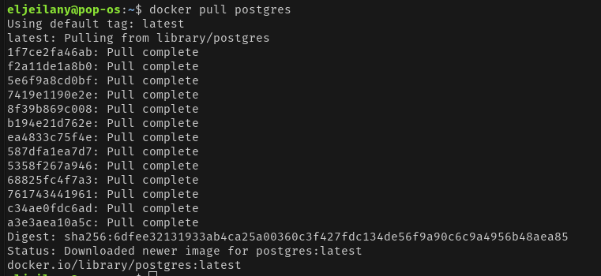
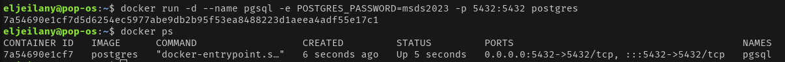
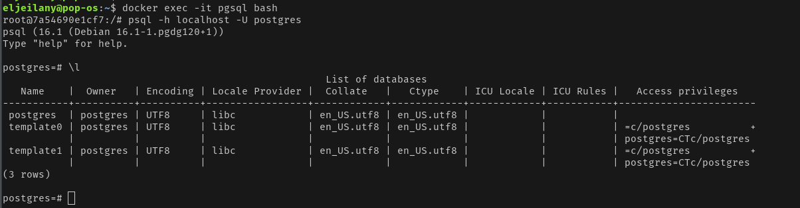
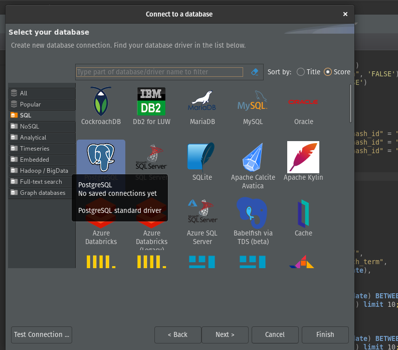
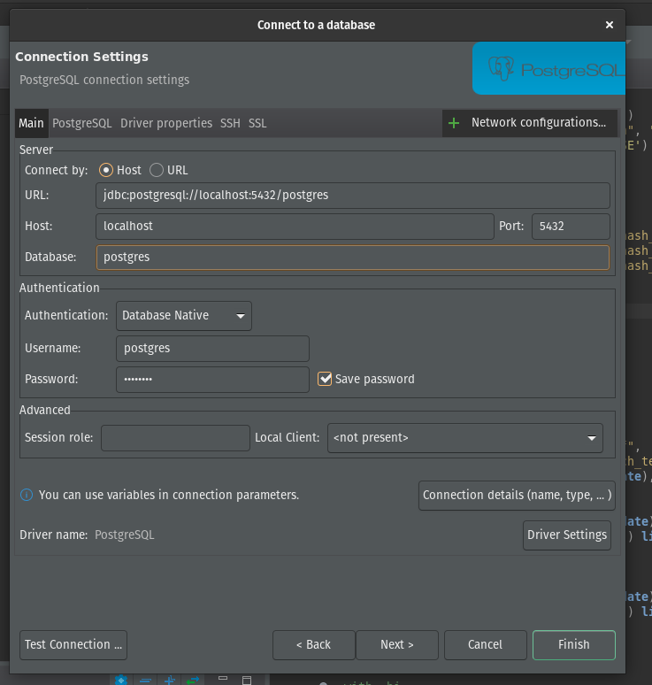
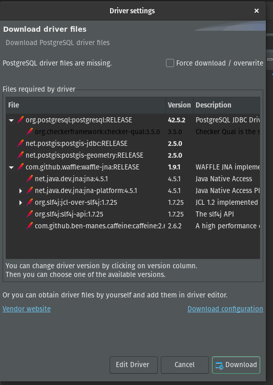

#  MSC Data Science for Business 2023 - Lab 1 PostgreSQL Docker Setup

## Table of Contents

- [About](#about)
- [Getting Started](#getting_started)
- [Usage](#usage)

## About <a name = "about"></a>

The following contains an explanation of how to deploy a PostgreSQL sever in as docker container 

## Getting Started with PostgreSQL on docker <a name = "getting_started"></a>

### Prerequisites
Docker is an open-source software platform used to create, deploy and manage containers.

You need to have Docker Engine installed on your machine. 
If you don't follow this [link](https://docs.docker.com/engine/install/) for the instructions on how to install it.

### Getting PostgreSQL

Once you have docker installed on your computer you can start by pulling the official Postgres image to your machine using the following comand
```
docker pull postgres
```
It should look something like this:


### Running PostgreSQL

To run the PostgreSQL image that we just pulled we can use the following command.
```
docker run -d --name pgsql -e POSTGRES_PASSWORD=msds2023 -p 5432:5432 postgres
```
And the following command to make sure it's running correctly
```
docker ps
```
The output should look like this:


## Usage <a name = "usage"></a>

We have 2 options to connect to our PostgreSQL server and start using it as a Database.

### Using PostgreSQL from terminal

We start by using the following command to access our running container's terminal.
```
docker exec -it pgsql bash
```

Next we connect to PostgreSQL using it's terminal-based front-end ```psql``` with:
```
psql -h localhost -U postgres
```
Finally we use the following comand to list all the running databases:
```
\l
```
The output should look similar to this:


Now we can start running our SQL queries.

### Using PostgreSQL with a GUI client like DBeaver:

Will use DBeaver as example of how to use a GUI client with PostgreSQL.
We can download DBeaver from the following [link](https://dbeaver.io/download/) and install it.

After starting DBeaver we go to ```Database > New Database Connection``` or we type ```Shift+Ctrl+N```
That will bring up the databse connection dialogue, it'll look like this:


Then we select PostgreSQL and click on next 


Then we set the password field to msds2023 and we click on finish.
If the program asks us to download drivers we click on download.



After this we can creat a new SQL script and start running our SQL queries.

